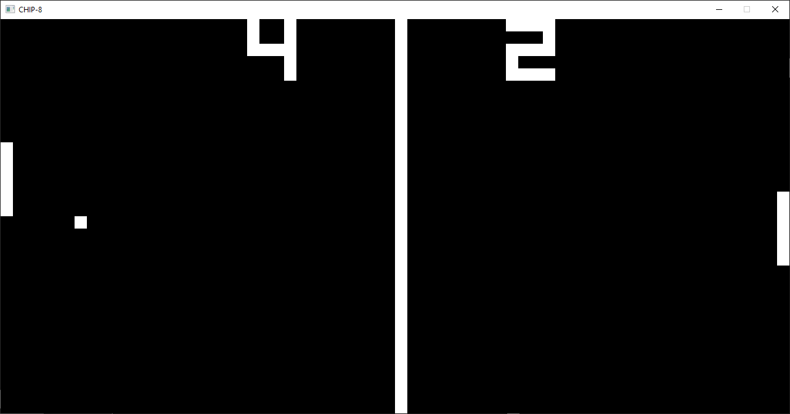

# CHIP-8

CHIP-8 interpreter written in Rust



## Usage

```
cargo run --release [ROM]
```

ROMs can be obtained [here](https://www.zophar.net/pdroms/chip8/chip-8-games-pack.html)

## Controls

<table>
<tr><th>Table 1 Heading 1 </th><th>Table 1 Heading 2</th></tr>
<tr><td>

|Table 1| Middle | Table 2|
|--|--|--|
|a| not b|and c |

</td><td>

|b|1|2|3| 
|--|--|--|--|
|a|s|d|f|

</td></tr> </table>

## Resources

Thanks to the following resources for helping in the creation of this interpreter:
* [Wikipedia](https://en.wikipedia.org/wiki/CHIP-8)
* [Mastering CHIP-8 - Matthew Mikolay](http://mattmik.com/files/chip8/mastering/chip8.html)
* [Cowgod's Chip-8 Technical Reference](http://devernay.free.fr/hacks/chip8/C8TECH10.HTM)
* [Emulator 101](http://www.emulator101.com/)
* [How to write an emulator (CHIP-8 interpreter)](http://www.multigesture.net/articles/how-to-write-an-emulator-chip-8-interpreter/)
* [ggez](https://ggez.rs/)
